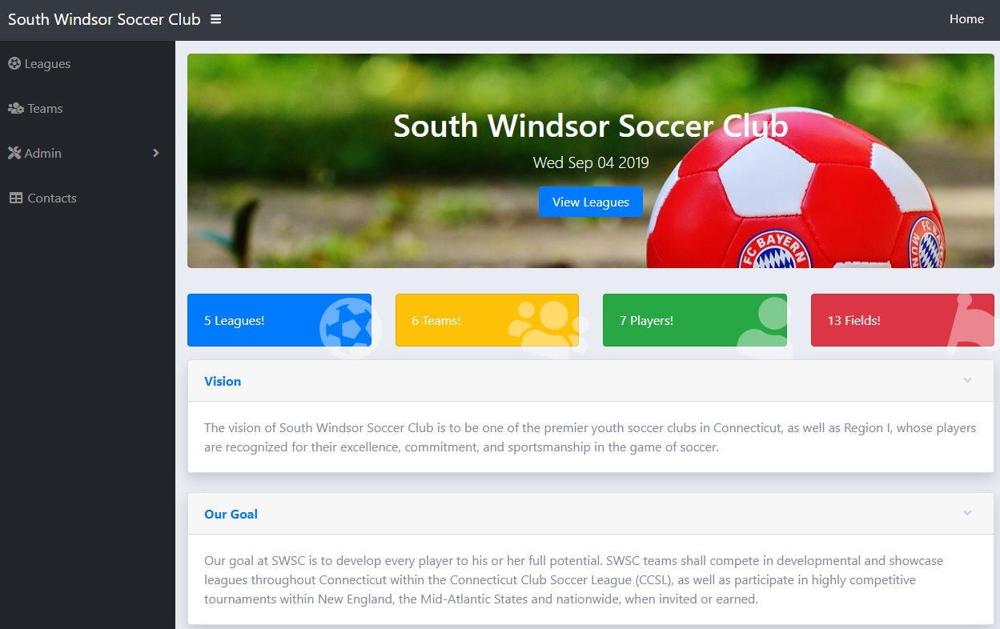

# SoccerClub
- Soccer Club - Capstone project
- The appication us used to create and manage teams including registering the players for a team. This web site is not be concerned with scheduling matches or scoring and keep track of team activities.
- This repo contains the code for the SoccerClub, a web based application using node.js,Express and jQuery..ect The data is stored in JSON files. 

## Instructions
1. Clone the repo on your computer.
2. Goto the folder in command prompt and install express using npm
    - npm install express --save
    - npm install body-parser --save
    - node server
3.  To launch the application goto to the folder http://localhost:8081/ 

## Features!
- Application provides a lookup functionality to view services by category.
- Users can provide the review comments about the serice.

## Technical Details
- The category,services information is stored in JSON files under data folder.
- The applciation contain a single page index.html.

## Technology used
* The application is utilizing Bootstrap 4.3, jQuery 3.3 
* Node.js, Express and HTML5..etc

The application code is in open source with a [public repository] on GitHub.

